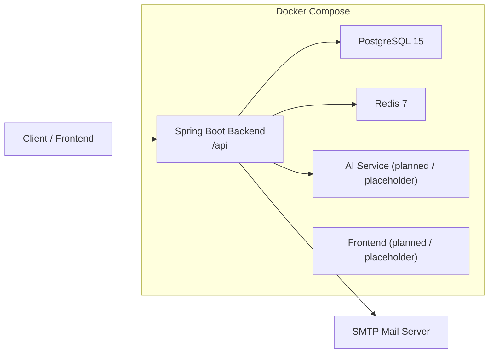

# Risk Register Import / Export Tool

## Overview

The Risk Register Import / Export Tool is a multi-service project for managing operational risks, user authentication, notifications, and future AI-assisted workflows around import/export processing.

The current repository includes:

- a Spring Boot backend for authentication, risk register APIs, caching, scheduling, and email notifications
- a placeholder `ai-service` workspace for a future Python microservice
- a placeholder `frontend` workspace for a future React + Vite application
- Docker Compose orchestration for local development

## Architecture



## Project Structure

```text
risk-register-import-export-tool/
|-- backend/              Spring Boot backend
|-- ai-service/           Python service workspace
|-- frontend/             React frontend workspace
|-- docker-compose.yml    Local multi-service orchestration
|-- .env.example          Environment variable reference
+-- README.md
```

## Backend Features

- JWT authentication with register, login, and refresh flows
- role-based access control for backend endpoints
- risk register CRUD foundation with paginated reads
- Flyway-backed schema migrations
- Redis caching for GET APIs
- scheduled email reminders and deadline alerts
- consistent success and error JSON responses
- startup seed data to maintain 30 risk records
- automated tests with JaCoCo coverage enforcement at 80%+

## Main API Endpoints

Base URL:

```text
http://localhost:8080/api
```

Auth endpoints:

- `POST /auth/register`
- `POST /auth/login`
- `POST /auth/refresh`

Risk register endpoints:

- `GET /risk-registers/all`
- `GET /risk-registers/{id}`
- `POST /risk-registers/create`

Health endpoint:

- `GET /actuator/health`

## Tech Stack

- Java 17
- Spring Boot 3.3.5
- Spring Security + JWT
- Spring Data JPA
- PostgreSQL 15
- Redis 7
- Flyway
- JavaMailSender + Thymeleaf
- Docker + Docker Compose
- JUnit 5 + Mockito + JaCoCo

## Prerequisites

Before running the project locally, install:

- Java 17
- Maven 3.9+
- Docker Desktop
- Git
- Node.js 20+ for frontend work
- Python 3.11+ for ai-service

## Setup Steps

### 1. Clone the repository

```powershell
git clone <your-repository-url>
cd risk-register-import-export-tool
```

### 2. Create an environment file

Copy `.env.example` to `.env` and update the values:

```powershell
Copy-Item .env.example .env
```

### 3. Run with Docker Compose

This is the simplest way to start all services together:

```powershell
docker compose up --build
```

Services:

- backend: `http://localhost:8080/api`
- PostgreSQL: `localhost:5432`
- Redis: `localhost:6379`
- AI service placeholder: `http://localhost:5000`
- frontend placeholder: `http://localhost:5173`

To stop the stack:

```powershell
docker compose down
```

To stop and remove volumes:

```powershell
docker compose down -v
```

## Backend Local Run

If you want to run only the backend outside Docker:

### 1. Start PostgreSQL and Redis

Make sure PostgreSQL and Redis are available locally or through Docker.

### 2. Run the backend

```powershell
cd backend
mvn spring-boot:run
```

### 3. Run tests

```powershell
cd backend
mvn test
```

## Environment Variable Reference

| Variable | Description | Default / Example |
|---|---|---|
| `SERVER_PORT` | Backend server port | `8080` |
| `AI_SERVICE_PORT` | AI service port | `5000` |
| `FRONTEND_PORT` | Frontend port | `5173` |
| `DB_HOST` | PostgreSQL host | `postgres` |
| `DB_PORT` | PostgreSQL port | `5432` |
| `DB_NAME` | PostgreSQL database name | `risk_register_import_export_tool_db` |
| `DB_USER` | PostgreSQL username | `postgres` |
| `DB_PASSWORD` | PostgreSQL password | `your_postgres_password` |
| `REDIS_HOST` | Redis host | `redis` |
| `REDIS_PORT` | Redis port | `6379` |
| `REDIS_PASSWORD` | Redis password | empty |
| `REDIS_TIMEOUT` | Redis timeout in ms | `6000` |
| `MAIL_HOST` | SMTP host | `smtp.gmail.com` |
| `MAIL_PORT` | SMTP port | `587` |
| `MAIL_USERNAME` | SMTP username | `your_email@example.com` |
| `MAIL_PASSWORD` | SMTP password / app password | `your_app_password` |
| `MAIL_SMTP_AUTH` | Enable SMTP auth | `true` |
| `MAIL_SMTP_STARTTLS_ENABLE` | Enable STARTTLS | `true` |
| `MAIL_SMTP_STARTTLS_REQUIRED` | Require STARTTLS | `true` |
| `JWT_SECRET` | JWT signing secret | `replace_with_a_long_random_secret_key` |
| `JWT_EXPIRATION_MS` | Access token expiry | `86400000` |
| `JWT_REFRESH_EXPIRATION_MS` | Refresh token expiry | `604800000` |
| `JWT_ISSUER` | JWT issuer | `risk-register-import-export-tool-backend` |
| `APP_SEED_ENABLED` | Enable startup seeding | `true` |
| `APP_SEED_TARGET_RISK_COUNT` | Target number of seeded risk records | `30` |
| `NOTIFICATION_FROM_EMAIL` | Sender email for notifications | falls back to `MAIL_USERNAME` |
| `NOTIFICATION_REMINDER_CRON` | Scheduler cron for reminders | `0 0 9 * * *` |
| `NOTIFICATION_REMINDER_WINDOW_DAYS` | Reminder look-ahead window | `3` |
| `GROQ_API_KEY` | Groq API key for future AI integration | `your_groq_api_key` |
| `GROQ_MODEL` | Groq model name | `llama-3.3-70b-versatile` |

## Verification

Backend verification command:

```powershell
cd backend
mvn test
```

Docker verification command:

```powershell
docker compose up --build
```

## Notes

- The backend is the most complete service in this repository right now.
- `frontend/` and `ai-service/` are present as project workspaces, but may still contain placeholder implementations depending on the current sprint progress.
- The backend returns structured JSON for both success and error responses.
- The test suite enforces a minimum backend coverage threshold during `mvn test`.
